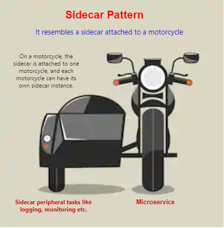
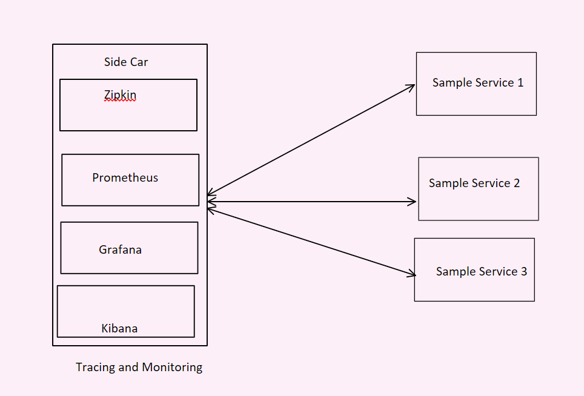
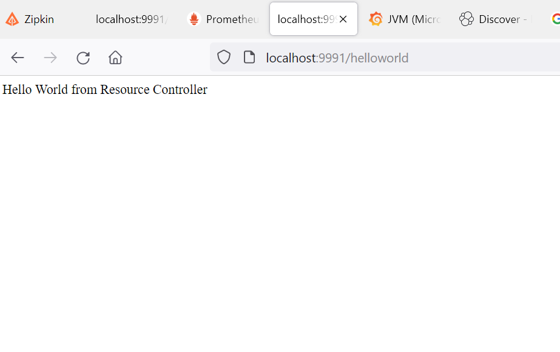
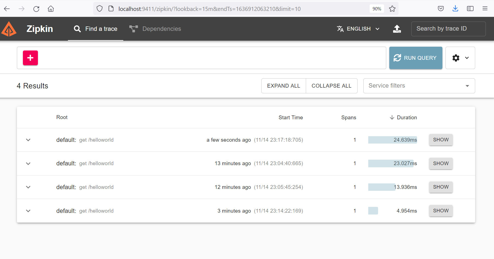
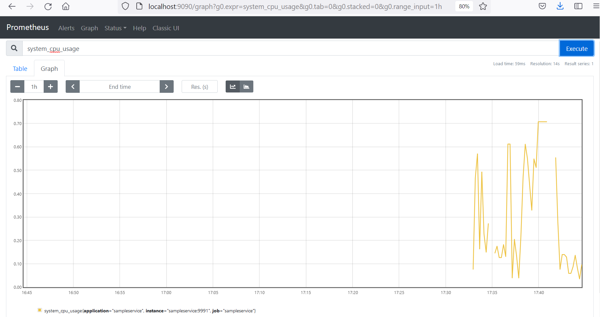
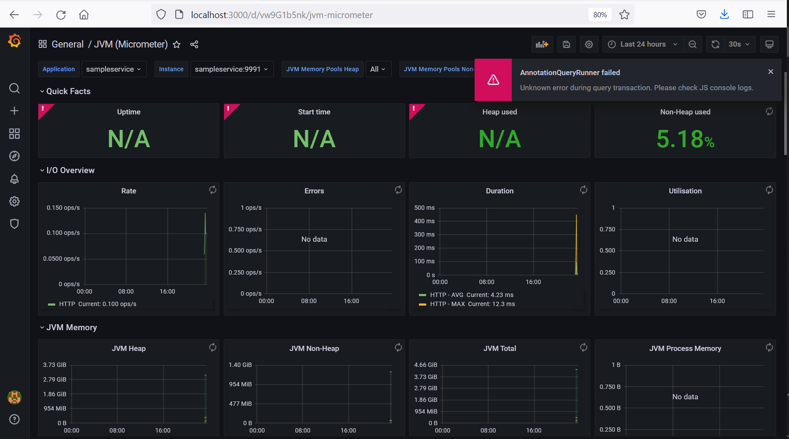
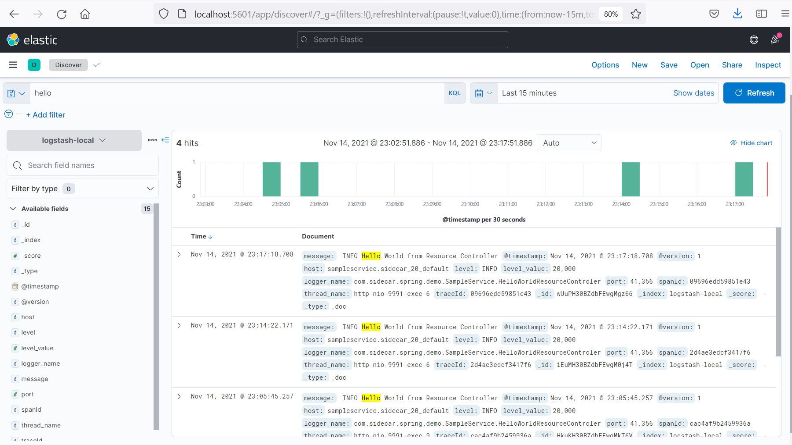

## Side Car Example

This Project is demostrate the Side car pattern. 




Following are the application running on different ports.

Sample Service - 9991 <br/>
Zipkin         - 9411 <br/>
Prometheus     - 9090 <br/>
Grafana        - 3000 <br/>
Kibana         - 5601 <br/>




### First step for running local.
for Windows Docker-Desktop
```

wsl -d docker-desktop
sysctl -w vm.max_map_count=262144

```

### Second step 
run the docker-compose 

```

docker-compose up --build

```

## Sample Service 
This is sample service 


<br/>

## Zipkin

<br/>

## Prometheus

<br/>

## Grafana

<br/>

## Kibana



